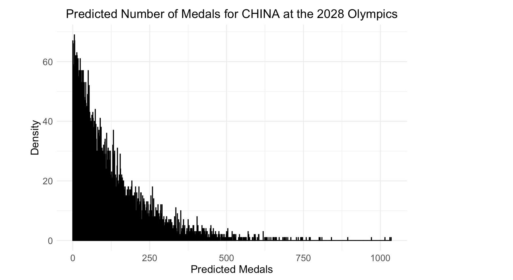

# MathematicalModeling2025 (See website https://yuuuulu.github.io/MathematicalModeling2025/ for more information)

We got "Honorable Mention" in 2025 MMC competition and this repo is used for future reflection of our work.

## Q1

### Baysian+Time series

This means we firstly fix a distribution and then I estimate one parameter using OLS while time-series ARMA for residuals to use more information and then use MCMC to find the other information to estimate variance.

$$\hat{\beta} = \text{argmin} \left( \sum_{i=1}^{n} \left( y_i - \beta_0 - \beta_1 x_1 - \sum_{j=2}^{n} \beta_j x_j - \sum_{j=2}^{n} \beta_j z_j - \sum_{j=2}^{n} \beta_{j+n} (x_j \times z_j) \right)^2 + \lambda \sum_{j=1}^{n} |\beta_j| \right)$$ $x_1$ is Host(0,1)

$X_j$ is ability(medals/all medals)

$Z_j$ is chance(participanting program/all programs)

NegativeBinomial inversegamma(not good enough...need further works...)

## Q2

### Penalized regression model

$$\hat{\beta} = \text{argmin} \left( \sum_{i=1}^{n} \left( y_i - \beta_0 - \beta_1 x_1 - \sum_{j=2}^{n} \beta_j x_j - \sum_{j=2}^{n} \beta_j z_j - \sum_{j=2}^{n} \beta_{j+n} (x_j \times z_j) \right)^2 + \lambda \sum_{j=1}^{n} |\beta_j| \right)$$ $x_1$ is Host(0,1)

$X_j$ is ability(medals/all medals)

$Z_j$ is chance(participanting program/all programs)

### linear regression for explanation

If we only use each country's chance(how many this country participating / all programs)\*ability(medals this country have in this program / all medals in this program) + Host in each sport program, we have following good-fitting linear relationship, meaning the importance of chance and ability, though it is trivial...:

### K-means

## Q3

。
